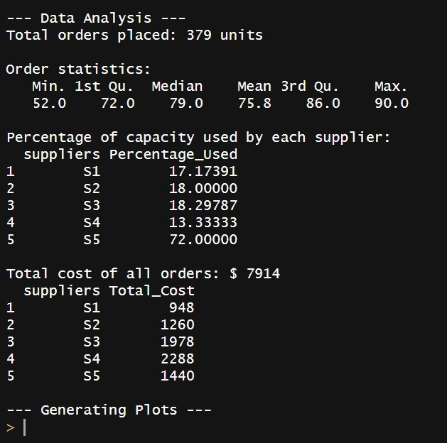

# Supplier Orders Data Analysis

This project provides a data analysis and visualization solution in R for managing supplier orders. It allows users to place orders, analyze order statistics, calculate costs, and visualize data with various plots.

## Features

- **Place Orders:** The `new_orders` function allows users to place orders from different suppliers while validating input.
- **Data Analysis:** The `analyze_orders` function provides a comprehensive analysis, including:
  - Total orders placed.
  - Order statistics (mean, median, etc.).
  - Percentage of capacity used by each supplier.
  - Total cost calculation for all orders.
- **Visualizations:** Generates bar charts and pie charts to visualize order distribution and capacity usage across suppliers.

## Installation

To use this project, ensure you have R and the necessary libraries installed.

1. Install R from [CRAN](https://cran.r-project.org/).
2. Install the required libraries:

   ```R
   install.packages("ggplot2")
## Usage

1. Clone this repository:
```bash
git clone https://github.com/vallz0/OrderAnalysisR.git
```
2. Load the necessary R scripts in your environment and use the functions:
```R
source("new_orders.R")
```
3. Create your own supplier data and call the `new_orders` and `analyze_orders` functions:
```R
suppliers <- c("S1", "S2", "S3", "S4", "S5")
capacity <- c(460, 500, 470, 390, 100)
price <- c(12, 14, 23, 44, 20)
summary <- data.frame(suppliers, capacity, price)

result <- new_orders(name = "Name", supplier_table = summary)
analyzed_data <- analyze_orders(result)
```
## Examples




